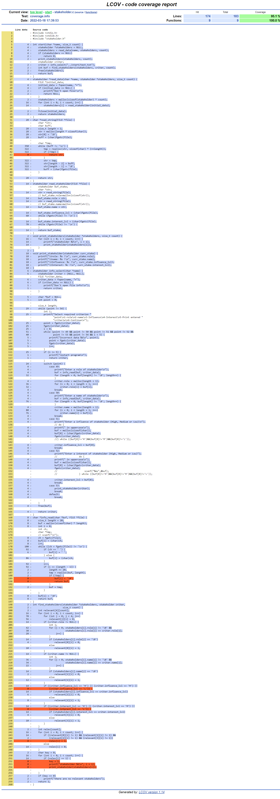

# iz_cpp
Гапоян Иван WEB-13  
Вариант #43  
Создать структуру для хранения информации о заинтересованных сторонах проекта: их роли (заказчик, покупатель, разработчик и пр.), наименовании или имени, степени влияния и т.д. Составить с ее использованием программу вывода информации обо всех заинтересованных лицах, наиболее соответствующих заданным пользователем критериям.

